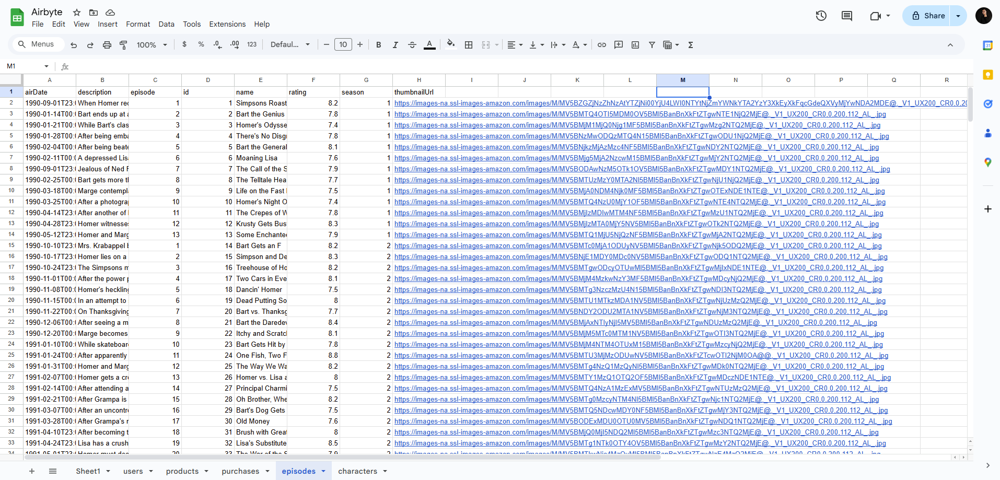

# 🚀 Airbyte Self-Learning Project

This repository documents my journey in exploring [Airbyte](https://airbyte.com), an open-source data integration platform. The project includes:

- Testing the **Faker** source connector.
- Creating a custom HTTP API connection to fetch data from the [Simpsons API](https://sampleapis.com/api-list/simpsons).

    

---

## 🔧 Project Setup

### Prerequisites

- Docker installed and running.
- Airbyte deployed locally or via Docker Compose.
- Basic understanding of data integration concepts.

### Installation

1. **Clone the repository:**

   ```bash
   git clone https://github.com/tunguyenn99/i-learn-airbyte.git
   cd i-learn-airbyte
   ```

2. **Start Airbyte:**

   Follow the [Airbyte Quickstart Guide](https://docs.airbyte.com/quickstart/deploy-airbyte/) to deploy Airbyte locally.

---

## 🧲 Testing the Faker Connector

The Faker connector generates synthetic data, useful for testing and development purposes.

### Steps:

1. **Create a new connection:**

   - **Source:** Faker
   - **Destination:** Your preferred destination (e.g., Local JSON, PostgreSQL)

2. **Configure the source:**

   - Set the number of records to generate.
   - Choose the data schema (e.g., users, products).

3. **Run the sync:**

   - Monitor the sync process via the Airbyte UI.
   - Verify the data in your destination.

### Screenshots:

- **Connection Setup:**

  

- **Sync Result:**

  

---

## 🌐 Integrating the Simpsons API

The goal is to fetch character data from the Simpsons API and load it into a destination.

### API Endpoint:

- `https://sampleapis.com/api-list/simpsons`

### Steps:

1. **Create a new HTTP API source:**

   - **Source Name:** Simpsons API
   - **URL:** `https://sampleapis.com/api-list/simpsons`
   - **HTTP Method:** GET
   - **Authentication:** None (if the API is public)

2. **Configure the destination:**

   - Choose your preferred destination connector.

3. **Run the sync:**

   - Monitor the sync process.
   - Validate the data in your destination.


### Screenshots:

- **Connection Setup:**

  

- **Sync Result:**

  

---

## 📁 Project Structure

```
i-learn-airbyte/
├── images/
│   ├── connection.png
│   ├── faker_result.png
│   ├── faker_setup.png
│   ├── simpson_result.png
│   ├── simpson_setup.png
├── Airbyte Certificate.pdf
├── README.md
└── ...
```

---

## 📚 Resources

- [Airbyte Documentation](https://docs.airbyte.com)
- [Faker Connector Guide](https://docs.airbyte.com/integrations/sources/faker)
- [Creating Custom Connectors](https://docs.airbyte.com/integrations/custom-connectors)

---

## 📄 License

This project is licensed under the MIT License. See the [LICENSE](LICENSE) file for details.